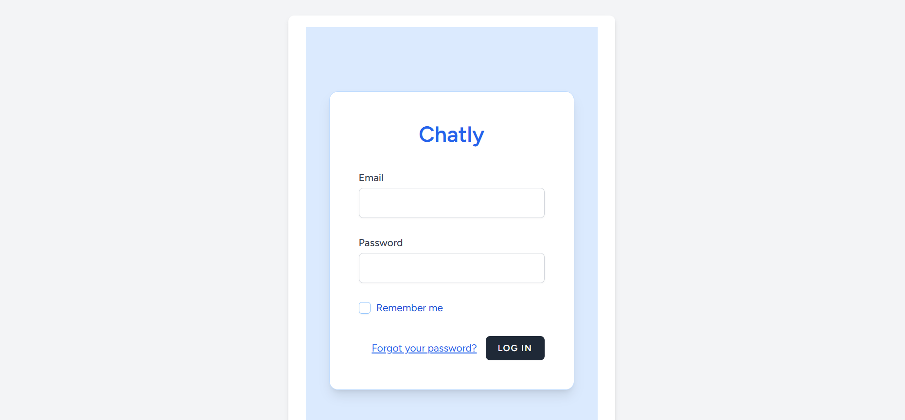
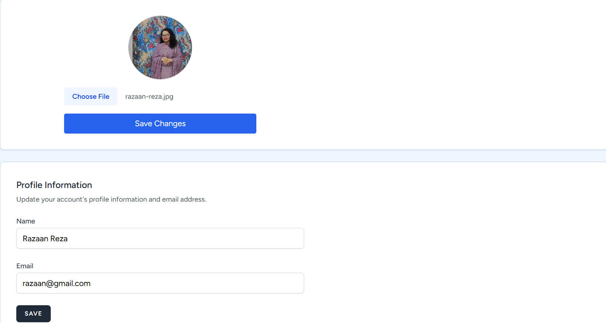
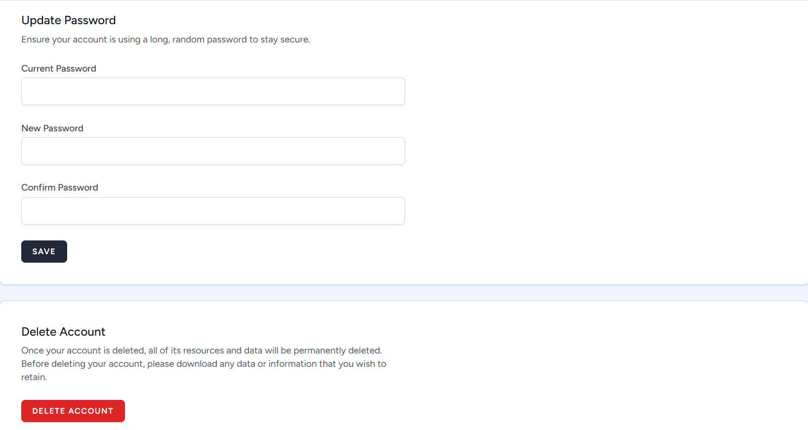
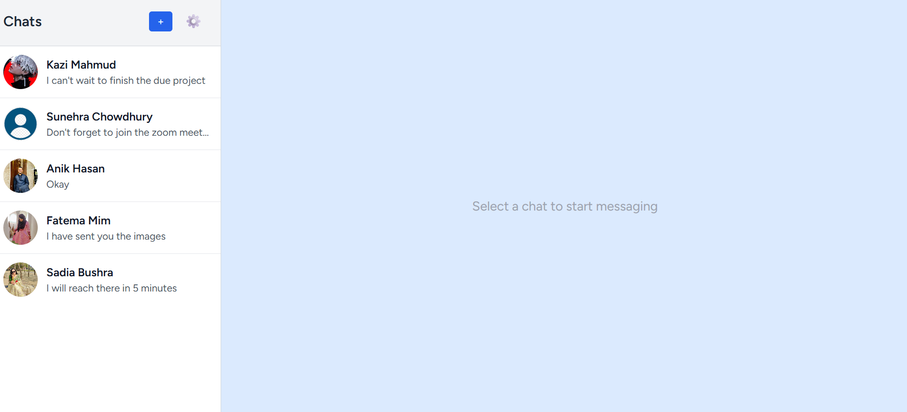
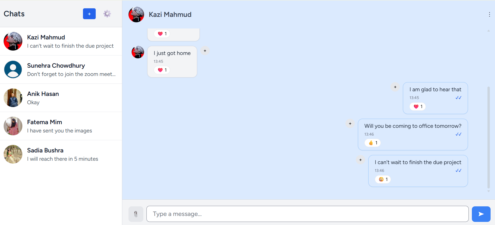
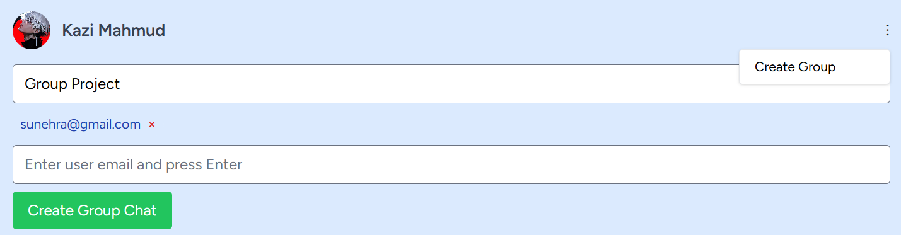
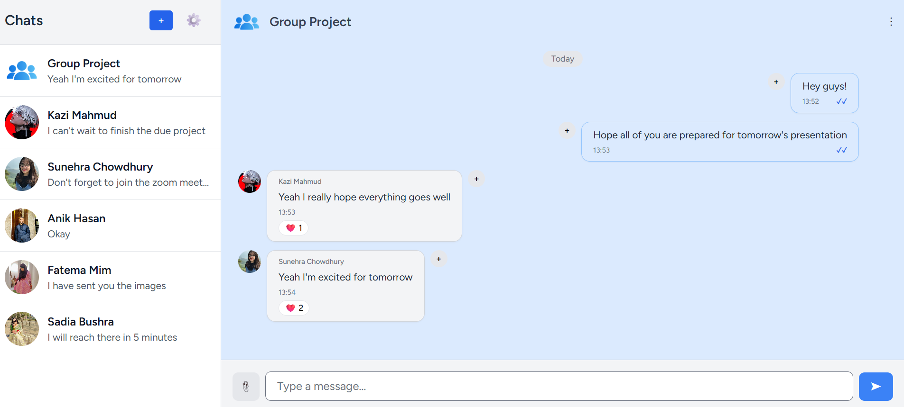

# 💬 Laravel Livewire Real-Time Chat App

A modern real-time chat application built with **Laravel**, **Livewire**, **Pusher**, and **Tailwind CSS**. Supports one-on-one and group messaging, complete with authentication, profile pictures, chat previews, and real-time updates.

> Created by [Razaan Reza](https://github.com/Razaan-RR) – [@Razaan-RR](https://github.com/Razaan-RR)

## 🚀 Features

- 🔐 User authentication (via Laravel Breeze)
- 🧑‍🤝‍🧑 One-on-one private chats
- 👥 Group chat creation and membership
- 📸 User profile pictures with preview and save
- 📬 Real-time messaging via **Pusher**
- ✅ Seen/delivered status per message
- 🕒 Timestamps for every message
- ❤️ React to messages with emojis
- 🔄 Instant UI updates with **Livewire 3 + Alpine.js**
- 🧭 Clean chat list with last message preview
- ➕ Add users by email to chats or groups
- ✅ Responsive and modern UI with Tailwind CSS
- 🔧 Profile management and logout from chat panel

## 🛠️ Tech Stack

| Tool/Library       | Purpose                               |
|--------------------|---------------------------------------|
| Laravel 10         | Backend framework                     |
| Laravel Breeze     | Authentication scaffolding            |
| Livewire 3         | Real-time frontend components         |
| Alpine.js          | Dropdowns and UI interactivity        |
| Pusher + Laravel Echo | Real-time broadcasting               |
| Tailwind CSS       | UI styling                            |
| MySQL / SQLite     | Database                              |

## 📷 Screenshots

### Chat UI

## 👤 Author

**Razaan Reza**
GitHub: [@Razaan-RR](https://github.com/Razaan-RR)

---
